# Architecture Diagram

This document describes the key API abstractions of finished-core. It focuses on interfaces, enums, and records in the public API (no implementations).

```mermaid
classDiagram
    direction TB

    %% Abilities package
    class AbilityExecutor <<interface>> {
        + apply(context: AbilityContext): GameState
    }

    class AbilityExecutors {
        + withListeners(delegate: AbilityExecutor, listeners: AbilityExecutionListener[*]): AbilityExecutor
        + withListeners(delegate: AbilityExecutor, listeners: Collection~AbilityExecutionListener~): AbilityExecutor
        + withAsyncListeners(delegate: AbilityExecutor, executor: Executor, listeners: AbilityExecutionListener[*]): AbilityExecutor
        + withAsyncListeners(delegate: AbilityExecutor, executor: Executor, listeners: Collection~AbilityExecutionListener~): AbilityExecutor
    }

    class AbilityExecutionListener <<interface>> {
        + afterAbility(event: AbilityExecutedEvent): void
    }

    class AbilityExecutedEvent {
        + ability: AbilitySpec
        + before: GameState
        + after: GameState
    }

    class AbilityContext {
        + state: GameState
        + ability: AbilitySpec
        + provider: DecisionProvider
    }

    class AbilityPhase <<enum>> {
        <<values>> GAME_START; TURN_START; USER_INPUT_REQUIRED; TURN_END; GAME_END_VICTORY; GAME_END_LOSE
    }

    class AbilitySpec <<enum>> {
        <<values>> BEGIN_GAME; BEGIN_TURN; TAKE_CANDY; SCORE_CARD; START; END_TURN_BEGIN; SEQUENCE_RULE; DRINK_COFEE; END_TURN_END; GAME_END_WIN; GAME_END_LOSE; DRAW_TWO; CARDS_INTO_PAST; DRAW_ONE; DRAW_ONE_3X; EXCHANGE_CARD; CARDS_FROM_PAST; CARD_INTO_FUTURE; EXCHANGE_PRESENT_CARD_ORDER; RESET_CANDIES; ALL_CARDS_INTO_FUTURE; BELOW_THE_STACK
        + id(): String
        + detailedDescription(): String
        + shortDescription(): String
        + requiresCandy(): boolean
        + cards(): List~Integer~
        + frequency(): int
        + phase(): AbilityPhase
        + order(): int
        + next(): List~Integer~
        + limit(): int
    }

    class DecisionProvider <<interface>> {
        + selectPresentCardIndices(state: GameState, count: int): List~Integer~
    }

    class DecisionProviders {
        + noOp(): DecisionProvider
    }

    %% Model package
    class GameState {
        + activeStash: Stash
        + reservedStash: Stash
        + drawStack: DrawStack
        + present: PresentArea
        + past: PastArea
        + futureAreas: List~FutureArea~
        + finishedPile: FinishedPile
        + activeAllCardsInFutureAreas: int
    }

    class Card {
        + number: int
        + candies: int
        + abilitiesTriggered: int
        + maxAbilities: int
    }

    class DrawStack {
        + cards: Deque~Card~
    }

    class PresentArea {
        + cards: List~Card~
    }

    class PastArea {
        + cards: Deque~Card~
    }

    class FutureArea {
        + cards: List~Card~
    }

    class FinishedPile {
        + cards: List~Card~
    }

    class Stash {
        + candies: int
    }

    %% OS package (example)
    class OSConfigStrategy <<interface>> {
        + getAppFilePath(): String
    }

    %% Relationships
    AbilityExecutor ..> AbilityContext : consumes
    AbilityExecutors ..> AbilityExecutor : decorates
    AbilityExecutors ..> AbilityExecutionListener : notifies
    AbilityExecutionListener ..> AbilityExecutedEvent : consumes
    AbilityExecutedEvent o-- GameState : has
    AbilityExecutedEvent ..> AbilitySpec : has
    AbilityContext o-- GameState : has
    AbilityContext ..> AbilitySpec : has
    AbilityContext ..> DecisionProvider : has
    GameState o-- Stash
    GameState o-- DrawStack
    GameState o-- PresentArea
    GameState o-- PastArea
    GameState o-- FutureArea
    GameState o-- FinishedPile
```

Notes:
- Only API-level abstractions are shown. No implementation classes are part of this module.
- Records are depicted as simple data holders for readability.
