# Runtime executors (finished-core)

This document surveys the concrete AbilityExecutor implementations provided by finished-core and how they map to AbilitySpec values and turn phases. It complements docs/architecture.md, which focuses on the API abstractions from finished-api.

Notes:
- Each executor implements the finished-api interface AbilityExecutor and transforms GameState purely based on input AbilityContext.
- AbilitySpec defines when an ability belongs in the turn lifecycle (AbilityPhase) and carries metadata like card numbers that can trigger it.
- UI/IO is external: decisions are obtained via DecisionProvider; post-execution notifications can be wired using AbilityExecutors.withListeners(...).
- Some executors load rule definitions from src/main/resources/rule-files.

## Overview diagram (concrete executors)

```mermaid
classDiagram
    direction TB

    class AbilityExecutor <<interface>>

    %% Turn flow
    class BeginGameExecutor
    class BeginTurnExecutor
    class EndTurnBeginExecutor
    class EndTurnEndExecutor

    %% Abilities
    class DrawOneExecutor
    class DrawTwoExecutor
    class DrawOne3xExecutor
    class BelowTheStackExecutor

    class CardsIntoPastExecutor
    class CardsFromPastExecutor
    class CardIntoFutureExecutor
    class AllCardsIntoFutureExecutor
    class ScoreCardExecutor
    class TakeCandyExecutor
    class ResetCandiesExecutor
    class ExchangeCardExecutor
    class ExchangePresentCardOrderExecutor
    class SequenceRuleExecutor
    class DrinkCofeeExecutor

    %% End-game
    class GameEndWinExecutor
    class GameEndLoseExecutor

    AbilityExecutor <|.. BeginGameExecutor
    AbilityExecutor <|.. BeginTurnExecutor
    AbilityExecutor <|.. EndTurnBeginExecutor
    AbilityExecutor <|.. EndTurnEndExecutor

    AbilityExecutor <|.. DrawOneExecutor
    AbilityExecutor <|.. DrawTwoExecutor
    AbilityExecutor <|.. DrawOne3xExecutor
    AbilityExecutor <|.. BelowTheStackExecutor

    AbilityExecutor <|.. CardsIntoPastExecutor
    AbilityExecutor <|.. CardsFromPastExecutor
    AbilityExecutor <|.. CardIntoFutureExecutor
    AbilityExecutor <|.. AllCardsIntoFutureExecutor
    AbilityExecutor <|.. ScoreCardExecutor
    AbilityExecutor <|.. TakeCandyExecutor
    AbilityExecutor <|.. ResetCandiesExecutor
    AbilityExecutor <|.. ExchangeCardExecutor
    AbilityExecutor <|.. ExchangePresentCardOrderExecutor
    AbilityExecutor <|.. SequenceRuleExecutor
    AbilityExecutor <|.. DrinkCofeeExecutor

    AbilityExecutor <|.. GameEndWinExecutor
    AbilityExecutor <|.. GameEndLoseExecutor
```

## Mapping: Class → AbilitySpec (Phase) with a short description

- Turn flow
  - BeginGameExecutor → AbilitySpec.BEGIN_GAME (AbilityPhase.GAME_START)
    - Initializes a new game state and starting areas/counters.
  - BeginTurnExecutor → AbilitySpec.BEGIN_TURN (AbilityPhase.TURN_START)
    - Prepares per‑turn state; may refresh counters and draw setup as defined by rules.
  - EndTurnBeginExecutor → AbilitySpec.END_TURN_BEGIN (AbilityPhase.TURN_END)
    - Performs pre‑finalization checks at turn end.
  - EndTurnEndExecutor → AbilitySpec.END_TURN_END (AbilityPhase.TURN_END)
    - Finalizes the turn (e.g., swap active/reserved stashes as per rules).

- Abilities
  - DrawOneExecutor → AbilitySpec.DRAW_ONE (AbilityPhase.USER_INPUT_REQUIRED or as defined)
    - Draws a single card into the present area.
  - DrawTwoExecutor → AbilitySpec.DRAW_TWO
    - Draws two cards into the present area.
  - DrawOne3xExecutor → AbilitySpec.DRAW_ONE_3X
    - Performs three successive single-card draws, applying per-draw rules.
  - BelowTheStackExecutor → AbilitySpec.BELOW_THE_STACK
    - Moves a chosen present card beneath the draw stack (or as rules specify) and draws replacement if applicable.

  - CardsIntoPastExecutor → AbilitySpec.CARDS_INTO_PAST
    - Moves selected present cards to the past area.
  - CardsFromPastExecutor → AbilitySpec.CARDS_FROM_PAST
    - Retrieves cards from the past area back to present, following limits/ordering rules.
  - CardIntoFutureExecutor → AbilitySpec.CARD_INTO_FUTURE
    - Sends a chosen present card to a future area.
  - AllCardsIntoFutureExecutor → AbilitySpec.ALL_CARDS_INTO_FUTURE
    - Pushes all present cards into a first future area; subsequent activations shift areas and immediately draw up to three cards.
  - ScoreCardExecutor → AbilitySpec.SCORE_CARD
    - Scores a present card to the finished pile according to scoring rules.
  - TakeCandyExecutor → AbilitySpec.TAKE_CANDY
    - Gains candies for the active stash.
  - ResetCandiesExecutor → AbilitySpec.RESET_CANDIES
    - Resets candies per rule definitions (often at specific phases).
  - ExchangeCardExecutor → AbilitySpec.EXCHANGE_CARD
    - Exchanges a present card with another eligible card per rules; may involve decision input.
  - ExchangePresentCardOrderExecutor → AbilitySpec.EXCHANGE_PRESENT_CARD_ORDER
    - Reorders the present area per decision provider or fixed rule.
  - SequenceRuleExecutor → AbilitySpec.SEQUENCE_RULE
    - Applies a special sequence-based rule from resources.
  - DrinkCofeeExecutor → AbilitySpec.DRINK_COFEE
    - Applies coffee-related rule effects (e.g., enabling extra actions) as defined in rule files.

- End-game
  - GameEndWinExecutor → AbilitySpec.GAME_END_WIN (AbilityPhase.GAME_END_VICTORY)
    - Applies victory conditions and final state transform.
  - GameEndLoseExecutor → AbilitySpec.GAME_END_LOSE (AbilityPhase.GAME_END_LOSE)
    - Applies losing conditions and final state transform.

## Resources and configuration
- Rule files
  - src/main/resources/rule-files/card_actions.json
  - src/main/resources/rule-files/card_actions_extended.json
  - src/main/resources/rule-files/game-abilities.json
  - src/main/resources/rule-files/game-info.md, game-loop.md (reference docs)

- Integration helpers
  - Wrap any executor with listeners to publish UI events after each execution: AbilityExecutors.withListeners(delegate, listeners...).
  - Provide user choices via a DecisionProvider. For headless or tests, DecisionProviders.noOp() is available in finished-api.

## Maintenance notes
- Keep this list in sync with classes under src/main/java/com/adrian/core.
- When adding a new executor, document the AbilitySpec mapping and any special decision inputs or rule-file dependencies.
